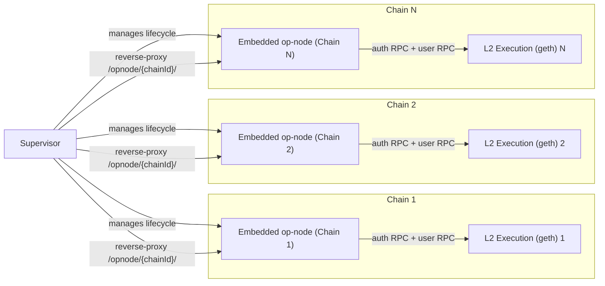
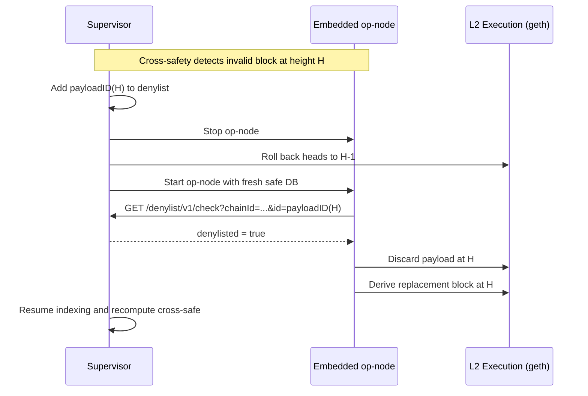

## Supervisor (pre-design overview)

This document describes a proof-of-concept (PoC). It is not production-ready and intentionally trades code quality and completeness for speed of exploration. The sole aim is to validate whether Supervisor logic can leverage a vanilla (pre-interop) `op-node` with minimal changes.

### What it is

- **Goal**: Provide interop cross-safety via an Supervisor that embeds and manages pre-interop op-nodes, computes cross-safe independently, and coordinates rollbacks when needed.
- **Scope**: One Supervisor process can manage multiple chains. For each chain it runs an embedded `op-node`, connects to the chain’s L2 EL and shared L1 RPCs, ingests data to local DBs, and computes cross-safe.
- **Core logic (consensus-critical; non-test) — supervisor ~1,127 LOC; op-node ~30 LOC**:
  - Ingest up to LocalSafe each tick and persist: payloads/receipts to `logs`, and `(L1 → L2)` links to `local` (and seed `cross` when empty).
  - Compute cross-safe across chains under an L1 confirmation depth/scope; when valid, update `cross` to advance cross-safe.
  - If a block is found cross-invalid (e.g., contains invalid executing messages), add its deterministic payload/block ID to a per-chain denylist, stop the embedded op-node, and roll back the op-node and EL to height H-1 (the last known-good).
  - On restart, as the op-node re-derives, it consults the Supervisor denylist (via `SV2_DENYLIST_URL`) and replaces the invalid block at height H with a deposit-only block per steady derivation rules, then proceeds.

  (see diagram and code walkthrough below for more detail)

### Key product simplifications and differences

- **No cross-unsafe validations or automatic reorg detection**:
  - The Supervisor does not implement cross-unsafe. It accepts sequencer blocks in real time and performs a single pass of ingest later, after transactions are submitted and confirmed on L1 (scope-gated by a confirmation depth and/or label).
  - This avoids dealing with live reorgs in the cross-unsafe window and removes the need for reorg detection machinery in Supervisor.
  - Result: the op-node requires only a minimal integration (denylist consult); otherwise it remains unchanged.

- **No P2P sync/replication of the Supervisor databases**:
  - The Supervisor’s logs/local/cross databases are maintained locally by the Supervisor instance. There is no peer-to-peer synchronization layer for these DBs.
  - Result: reduced complexity, fewer moving parts, and no additional network protocols.

- **Minimal op-node changes**:
  - The op-node remains pre-interop and unmodified with the exception of an optional denylist consult (enabled by `SV2_DENYLIST_URL`) before inserting a payload. If denylisted, the payload is treated as invalid and skipped.
  - There are no interop-specific storage changes or cross-safety logic added to the op-node.

### Why “no cross-unsafe” works here

- In prior approaches, cross-unsafe would validate and react to cross-chain conditions before sufficient L1 certainty, requiring reorg handling.
- Here we only compute and enforce cross-safe after applying an L1 confirmation depth (or a scope label) and after a single ingest pass. We accept sequencer blocks in real-time and avoid cross-unsafe reorg work entirely.
- This materially simplifies the system and keeps op-node changes minimal.

### Architecture at a glance



### Denylist-driven rollback and re-sync



### Implementation walkthrough

- **Startup and HTTP** (`supervisor/supervisor.go`):
  - `NewSupervisor` wires logger, shared linker state, L1 scope label, polling cadence, data directory, and a persisted denylist store.
  - `HTTPHandler` exposes health/status, v1-compatible query endpoints, `POST /admin/rollback`, and `GET /denylist/v1/check`. An optional `/opnode/` reverse proxy can expose the embedded op-node’s user RPC.
  - `StartManaged` launches an embedded op-node and starts a single-chain poller. Multi-chain runs use `AddChain` per chain.

- **Per-chain loop** (`supervisor/chain_orchestrator.go`):
  - `AddChain` starts an embedded op-node, opens per-chain DBs (`logs`, `local`, `cross`), registers the chain, and spawns a per-chain poller goroutine.
  - Each tick: fetch `SyncStatus` from the op-node, ingest up to `LocalSafe` into `logs` and `local`, bootstrap `cross` from `local` once, then run one cross-safe step.
  - The loop logs heads for observability and lazily initializes the L1 client.

- **Ingest pipeline** (`supervisor/ingest.go`):
  - `ingestRange` fetches payloads and receipts per block, writes logs, seals blocks, and appends `(L1 source → L2 derived)` links to `local` (and `cross` when set).
  - `addDerivedWithDiagonalSplit` maintains consistent ordering when both source and derived advance together.

- **Cross-safe adapter** (`supervisor/crosssafe_adapter.go`):
  - Implements the cross-safety algorithm against the v1-style DBs, with lookups for other chains and reads registry integration.
  - Applies L1 confirmation-depth gating to define the scope, selects candidates, and updates `cross`.
  - On cross-invalid, `InvalidateLocalSafe` rewinds local, adds the deterministic payload ID to the denylist, and calls rollback to `H-1`.

- **Rollback** (`supervisor/rollback.go`, orchestrated from `RollbackChain` in `chain_orchestrator.go`):
  - Stops polling and the embedded op-node for the chain, rolls back the EL to an absolute target (currently via `debug_setHead` on the user RPC), restarts the op-node, and resumes polling.
  - Single-chain legacy path is handled for back-compat; multi-chain uses per-chain handles.

- **Denylist** (`supervisor/denylist.go` + HTTP):
  - Lightweight persisted map keyed by `(chainID, payloadID)`. Exposed via `GET /denylist/v1/check` and populated by Supervisor policy (e.g., during invalidation). The op-node consults this endpoint once before inserting a payload when `SV2_DENYLIST_URL` is set.

### Core op-node interop loop (per tick)

This section walks through the per-chain tick in detail, showing how we ingest up to local-safe, detect cross-unsafe conditions, and trigger rollback + denylist when necessary.

1) Poll the op-node and set up targets

```309:343:op-supervisor-v2/supervisor/chain_orchestrator.go
                st, err := roll.SyncStatus(ctxPoll)
                if err != nil || st == nil {
                    s.log.Warn("poll: sync status error", "err", err)
                    continue
                }
                // Ensure L1 client is initialized (may fail early before L1 comes up)
                l1Cli, l1 = s.ensureL1Client(ctxPoll, l1Cli, l1, h.embeddedCfg.l1RPC, rcfg)
                // Ingest strictly up to local-safe; skip until local-safe progresses
                target := st.LocalSafeL2
                // Include cross-safe (from cross DB) for observability
                var crossSafe any
                if h.crossDB != nil {
                    if pair, err := h.crossDB.Last(); err == nil {
                        crossSafe = pair.Derived
                    }
                }
                s.log.Info("poll: heads", "chain", chainID, "unsafe", st.UnsafeL2, "local_safe", st.LocalSafeL2, "safe", st.SafeL2, "finalized", st.FinalizedL2, "cross_safe", crossSafe)
                if target.Number == 0 {
                    continue
                }
```

2) Ingest to local-safe and maintain logs/local DBs

```330:341:op-supervisor-v2/supervisor/chain_orchestrator.go
                if h.logsDB != nil && h.localDB != nil && l1 != nil {
                    s.ingestToLocalSafe(ctxPoll, h, l1, l2, rcfg, chainID, target.Number)
                    s.seedLocalIfEmpty(ctxPoll, h, l1, l2, rcfg, chainID, target.Number)
                    s.debugIngestHeads(h, chainID)
                }
```

Under the hood, ingest fetches payloads + receipts and appends logs and `(L1 → L2)` links:

```45:64:op-supervisor-v2/supervisor/ingest.go
func ingestRange(ctx context.Context, l1 *sources.L1Client, l2 *sources.L2Client, logs *logsdb.DB, local *fromda.DB, cross *fromda.DB, rollupCfg *sources.L2ClientConfig, start, end uint64) error {
    for n := start; n <= end; n++ {
        env, err := l2.PayloadByNumber(ctx, n)
        // ...
        info, receipts, err := l2.FetchReceiptsByNumber(ctx, n)
        // collect logs and write to logs DB
        // ...
        if err := logs.SealBlock(ref.ParentHash, eth.ToBlockID(info), ref.Time); err != nil { return err }
```

```94:111:op-supervisor-v2/supervisor/ingest.go
        // Add local-safe link
        l1Ref, err := l1.BlockRefByNumber(ctx, l1Source.Number)
        // ... validate L1 hash matches ...
        derivedRef := ref.BlockRef()
        if err := addDerivedWithDiagonalSplit(ctx, l2, local, rollupCfg, l1Ref, derivedRef); err != nil { return err }
        if cross != nil {
            if err := addDerivedWithDiagonalSplit(ctx, l2, cross, rollupCfg, l1Ref, derivedRef); err != nil { return err }
        }
```

3) Bootstrap cross DB once (from local) to enable cross-safe progression

```335:338:op-supervisor-v2/supervisor/chain_orchestrator.go
                if h.crossDB != nil && h.localDB != nil {
                    s.bootstrapCrossIfEmpty(ctxPoll, h, l1, l2, rcfg, chainID)
                }
```

4) Run one cross-safe step and check for cross-unsafe

```340:343:op-supervisor-v2/supervisor/chain_orchestrator.go
                if h.logsDB != nil && h.localDB != nil && h.crossDB != nil {
                    adapter := s.newCrosssafeAdapter(h, l1, l2, rcfg, chainID)
                    s.runCrossSafeStep(ctxPoll, adapter, chainID)
                }
```

The adapter finds a candidate within an L1 scope window (confirmation depth) and updates cross-safe if valid:

```103:116:op-supervisor-v2/supervisor/crosssafe_adapter.go
func (a *crosssafeAdapter) CandidateCrossSafe(chain eth.ChainID) (types.DerivedBlockRefPair, error) {
    st, err := a.rollupSync()
    // derive scopeNum = HeadL1 - confirmDepth, clamp to last known source
```

```172:186:op-supervisor-v2/supervisor/crosssafe_adapter.go
    if db != nil {
        if cand, cerr := db.Candidate(l1Ref.ID(), after, rev); cerr == nil {
            return cand, nil
        } // else: fall back to local mapping
    }
```

```277:303:op-supervisor-v2/supervisor/crosssafe_adapter.go
func (a *crosssafeAdapter) UpdateCrossSafe(chain eth.ChainID, l1View eth.BlockRef, lastCrossDerived eth.BlockRef) error {
    // resolve DBs for the chain
    rev, err := localDB.SourceToRevision(l1View.ID())
    if err != nil { return err }
    return crossDB.AddDerived(l1View, lastCrossDerived, rev)
}
```

If the cross check fails (i.e., candidate is cross-unsafe), the adapter invalidates local-safe, deny-lists the payload, and triggers rollback:

```315:336:op-supervisor-v2/supervisor/crosssafe_adapter.go
func (a *crosssafeAdapter) InvalidateLocalSafe(chainID eth.ChainID, candidate types.DerivedBlockRefPair) error {
    // 1) rewind and mark invalid in local DB
    if err := localDB.RewindAndInvalidate(inv, candidate); err != nil { return err }
    // 2) compute deterministic payload header-hash and add to denylist
    if actual, ok := env.CheckBlockHash(); ok { _ = a.addDenylist(v, actual.Hex()) }
    // 3) rollback EL to H-1 to force replacement
    return a.rollback(context.Background(), v, candidate.Derived.Number-1)
}
```

5) Rollback orchestration (stop → rollback → restart)

```481:506:op-supervisor-v2/supervisor/chain_orchestrator.go
    if h.cancelPoll != nil { h.cancelPoll(); h.cancelPoll = nil }
    if h.stopEmbeddedOpNode != nil { _ = h.stopEmbeddedOpNode(c) }
    if err := rollbackEL(ctx, h.embeddedCfg.l2UserRPC, toBlock); err != nil { return err }
    userRPC, stopFn2, err := s.StartEmbeddedOpNode(...)
    // re-dial clients, start ticker, resume poll loop
```

6) How the op-node enforces the denylist on re-derive

```34:53:op-node/rollup/engine/payload_process.go
    // Optional SV2 denylist pre-insert check
    if baseURL := os.Getenv("SV2_DENYLIST_URL"); baseURL != "" && ev.Envelope != nil && ev.Envelope.ExecutionPayload != nil {
        if payloadID, ok := ev.Envelope.CheckBlockHash(); ok {
            url := fmt.Sprintf("%s/denylist/v1/check?chainId=%d&id=%s", baseURL, chainID, payloadID.Hex())
            // ... HTTP GET and decode { denylisted: bool }
            if out.Denylisted {
                eq.emitter.Emit(ctx, PayloadInvalidEvent{ /* ... */ })
                return
            }
        }
    }
```

On restart, the embedded op-node queries the Supervisor’s denylist before inserting the previously-invalid payload at height H; if denylisted, it skips and derives a replacement block at H.

### Minimal op-node integration

- The op-node has an optional pre-insert denylist check guarded by `SV2_DENYLIST_URL`. If the Supervisor reports a payload ID as denylisted, the op-node treats the payload as invalid and derives a replacement at the same height.
- No interop-specific storage or cross-safety logic is added to the op-node; it stays pre-interop.

### Operational notes

- Use absolute rollback targets and pass `?chainId=` in multi-chain operations.
- Apply L1 confirmation depth (e.g., ~40) before cross-safety to avoid reorging cross-safety decisions.
- The Supervisor DBs are local-only in this version; there is no P2P replication.

### Non-goals (current)

- Cross-unsafe validation and live reorg handling.
- P2P synchronization/replication of Supervisor databases.
- Opinionated metrics beyond basic logging (pluggable later).

### Future work

- Replace `debug_setHead` with an authenticated Engine API forkchoice update to support broader ELs without changing finalized.
- Optional cache/TTL on denylist checks to reduce HTTP load.
- Readiness gates and richer metrics for ingest lag and cross-safe progress.

- Reuse existing alt-DA “denylist”-like mechanism where applicable, to avoid duplicating policy/state.
- Reminder: this is a PoC intended for exploration/experimentation only; do not run in production.

### FAQ

- **How do we detect invalid executing messages without cross-unsafe in the node?**
  - This PoC keeps the `op-node` minimal. Detection can live in external monitoring (or even in the batcher) that validates interop references before they are batched. When a monitor flags an invalid reference, operators can trigger an operational response (e.g., pause/rollback and recover) rather than relying on in-node cross-unsafe. See the Interop AutoStop design for an operator playbook and recovery flow ([Design: Interop AutoStop](https://github.com/ethereum-optimism/design-docs/pull/287)).

- **How do we avoid being DoS’d by streams of invalid interop references?**
  - Pre-screen at RPC ingress (e.g., proxyd) and reject requests that reference invalid/unavailable executing messages before they reach the sequencer. This can be as simple as an `eth_getLogs`/headers check or a purpose-built validator. Add rate limiting/backoff and return structured errors so clients back off; proxyd can also implement automatic backoff when it sees AutoStop-style errors (see discussion in the same design PR above).

- **Can we simplify further?**
  - Likely. Candidates include stricter L1 scope gating to defer work earlier, making the logs DB optional when only cross-safe is needed, reusing alt-DA’s denylist to avoid duplicate policy/config, and moving more checks to the batcher/proxyd. This PoC is deliberately minimal and expected to evolve.


