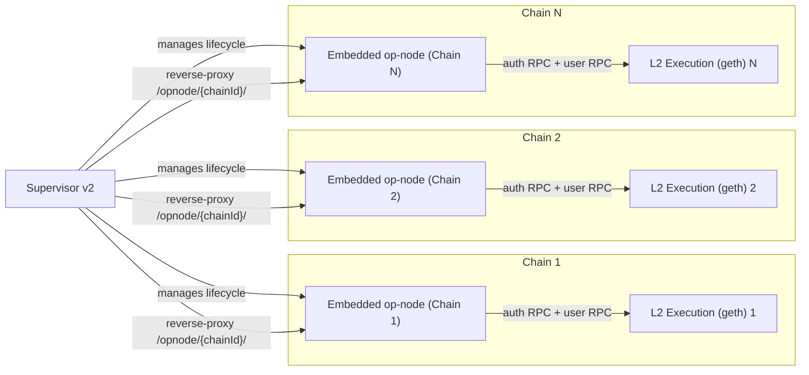
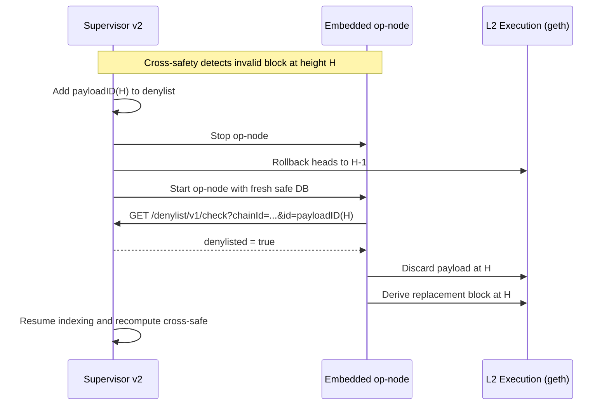

## Supervisor v2 explainer

### What it is

- **Goal**: Enable interop-era cross-safety without requiring large changes to `op-node`. SV2 embeds and manages pre-interop op-nodes, computes cross-safety itself, and coordinates rollbacks when needed.
- **Scope**: One SV2 process can manage multiple chains. For each chain it runs an embedded `op-node` and connects it to the chain’s L2 EL and shared L1 RPCs.
- **HTTP surface**:
  - Health and status (per-chain).
  - Denylist check: `GET /denylist/v1/check?chainId=<id>&id=<payloadId>` → `{ denylisted: bool }`.
  - Reverse-proxy for user-RPC: `/opnode/{chainId}/` (single-port UX; in tests this is enabled by default).

References:
- Design: `docs/design/op-supervisor-v2.md`.
- Sysgo integration: `op-devstack/sysgo/supervisor_v2.go` (creates SV2, enables proxy, starts embedded op-nodes, exports `SV2_DENYLIST_URL`).
- op-node denylist hook: `op-node/rollup/engine/payload_process.go` (optional pre-insert query to SV2 when `SV2_DENYLIST_URL` is set).

### How it works

- **Managed op-node per chain**: SV2 starts an embedded op-node and polls heads via a per-chain loop. Op-node remains pre-interop; it does not persist cross-safety.
- **Local-safe and cross-safe**: SV2 ingests local-safe inputs, applies L1 confirmation-depth gating, and computes cross-safe across chains.
- **Rollback + denylist** (on cross-invalid):
  1. Add the deterministic payload ID at height H to a per-chain denylist.
  2. Stop the embedded op-node.
  3. Roll back EL heads to H-1 (last known-good), without changing finalized.
  4. Clear the op-node safe DB and restart the op-node.
  5. During re-derivation, the op-node queries SV2’s denylist before inserting a payload. If denylisted, it treats it as invalid and skips it, producing a replacement block at H.

### Conceptual framework

- **Extra validity layer**: Think of SV2 as adding a narrow, orthogonal set of block-validity conditions on top of the op-node’s existing derivation. These conditions are checked out-of-band by SV2 and enforced by the op-node via a single denylist consult.
- **Backwards compatibility**: In normal operation, these conditions never trigger, the denylist is empty, and the op-node runs unchanged. The integration is opt-in (env var) and defaults to no-op.
- **Small surface area**: Because enforcement is just “check once before payload insert; if denylisted, reject like any malformed payload,” the integration touches very few lines in the op-node and does not require interop-specific storage or cross-safety logic in the node.

### Diagram: one Supervisor v2 managing many op-nodes

### Diagram: denylist-driven rollback and re-sync

### Operational notes

- Enable op-node denylist integration by setting `SV2_DENYLIST_URL` in the op-node environment. If unset, op-node behavior is unchanged.
- Use absolute rollback targets and chain scoping for multi-chain admin operations.
- Apply L1 confirmation depth (default ~40) before cross-safety to avoid reorging cross-safety decisions.

### External data sources and programmatic rollbacks

- **Using external oracles (e.g., Solana)**: External checks can be integrated by querying another system and then steering SV2 with its admin API. A controller can:
  1. Compute the candidate L2 payload ID at height H;
  2. Decide it is invalid based on external data (e.g., a Solana state condition);
  3. Add that payload ID to the denylist (internal policy or test harness);
  4. Call `POST /admin/rollback` with `to_block_number = H-1` (and `?chainId=` in multi-chain runs);
  5. The embedded op-node will re-derive and skip the denylisted payload, replacing the block at H.
- This lets SV2 consume off-chain or cross-chain truth sources to enforce correctness without modifying the op-node beyond the denylist consult.

### Minimal op-node changes for SV2

- **Denylist check before payload insertion**: When `SV2_DENYLIST_URL` is set, op-node queries SV2 at `GET /denylist/v1/check?chainId=&id=` using the deterministic payload ID; if denylisted, it treats the payload as invalid and discards it. Reference: `op-node/rollup/engine/payload_process.go`.
- **Interop2 activation (predeploys + cross-L2 inbox)**: Added `interop2_time` to rollup config with helpers; at activation, the sequencer injects the same predeploys as interop and enables cross-L2 inbox. CLI override: `--override.interop2`. References: `op-node/rollup/types.go` (`Interop2Time`, `IsInterop2*`), `op-node/rollup/derive/attributes.go` (activation handling), `op-service/flags/flags.go` (flag wiring).

